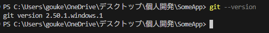

# Gitの使い方メモ（基本編）

## 環境構築

1. https://gitforwindows.org/ から、Gitをダウンロードする  
   

2. git --version でインストールされたかを確認する  
     

3. https://github.com/ から、GitHubのアカウントを作成する  
   

4. 以下のコマンドで、Gitのユーザ名とメールアドレスを設定する。  

   ```:ユーザ名の設定コマンド
   git config --global user.name "ユーザー名は任意"
   ```

   ```:メールアドレスの設定コマンド
   git config --global user.email "メールアドレス"
   ```

   ```:日本語ファイル名がエスケープされないようにする
   git config --global core.quotepath false
   ```

   ※すでに登録されているかどうかを確認するコマンドはこちら

   ```:ユーザ名の確認コマンド
   git config --global user.name
   ```

   ```:メールアドレスの確認コマンド
   git config --global user.email
   ```

5. sshキーを作成する(何のためになのかは今のところ不明)

   ```sshキーの作成
   ssh-keygen
   ```

## Gitの基本操作  

ローカルリポジトリの作成＆GitHubへのアップロードまで行う

1. リモートリポジトリを作成する  
   https://github.com/ へアクセスする
   

2. Newを押す
   

3. ...or create a repository on the command line の部分をコピペする
   

4. コピペしたものを流す
   

5. 流した後は以下の通り
   